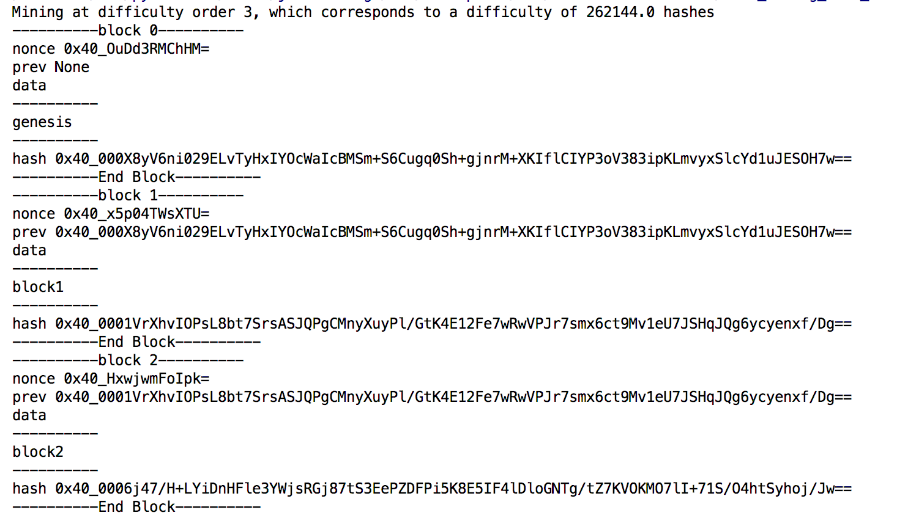
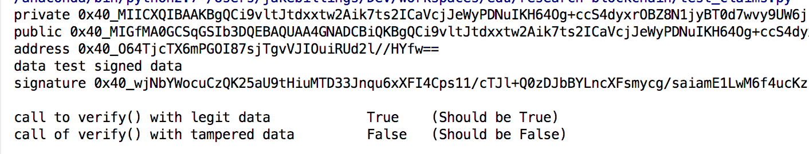

# research-blockchain #

This repository contains my research into the technologies surrounding blockchain technology and cryptocurrencies such as Ethereum and Bitcoin that is published in the paper Image-based Proof of Work Algorithm for the Incentivization of Blockchain Archival of Interesting Images.

[Click Here to Read the Full Paper](https://arxiv.org/abs/1707.04558)

### Blockchain like Bitcoin ###
The files `blockchain_like_btc.py` and `test_mining_like_btc.py` test a blockchain that was built with a simplified version of the algorithm used by Bitcoin.
To mine a block, a nonce must be found that satisfies the condition that a hash of block data, the previous block's hash, and the nonce must have a given number of leading 0's.
The difficulty of the block is determined by how many leading figure must be 0s.
A difficulty order of 2 corresponds to hashes of blocks needing two leading 0s to be considered valid.
The hash `0x40_000JB1Qn1gzNckyp1XU5UFhUAidhZB...` is valid for a difficulty of `3` or less.
The hash `0x40_00AJB1Qn1gzNckyp1XU5UFhUAidhZB...` is valid for a difficulty of `2` or less. Test mining builds a dummy blockchain using dummy data.

### Blockchain that Spells Words ###
`blockchain_spells_words.py` was created as an experiment. It uses a modified mining algorithm to spell words in the hash of every block instead of padding it with 0's.
This has no practical application. It was just a fun experiment.
In blockchain that spells words, the first `DIFFICULTY_ORDER` letters of the difficulty phrase will be spelled out in every single block
This does not change the difficulty of mining blocks. It just tells the mining algorithm to search for specific
words instead of 0s.
The hash `0x40_timJB1Qn1gzNckyp1XU5UFhUAidhZB...` might be found with a difficulty of `3`
The hash `0x40_timthebeaverckyp1XU5UFhUAidhZB...` might be found with a difficulty of `12`
The hash `0x40_timthebeaver000p1XU5UFhUAidhZB...` might be found with a difficulty of `15`
The difficulty phrase for will always be the length of the encoded hash output. Shorter phrases will be padded with 0s
For instance, `timthebeaver` becomes `timthebeaver000000....`

### Signatures and Claims ###

`test_claims.py` and `signature.py` wrap and use the PyCrypto API to generate and store signed claims using the PyCrypto `RSA` object.

### Other Projects ###
Checkout my other projects at [http://www.jakebillings.com](http://www.jakebillings.com) or contact me via [LinkedIn](https://www.linkedin.com/in/jake-billings/).